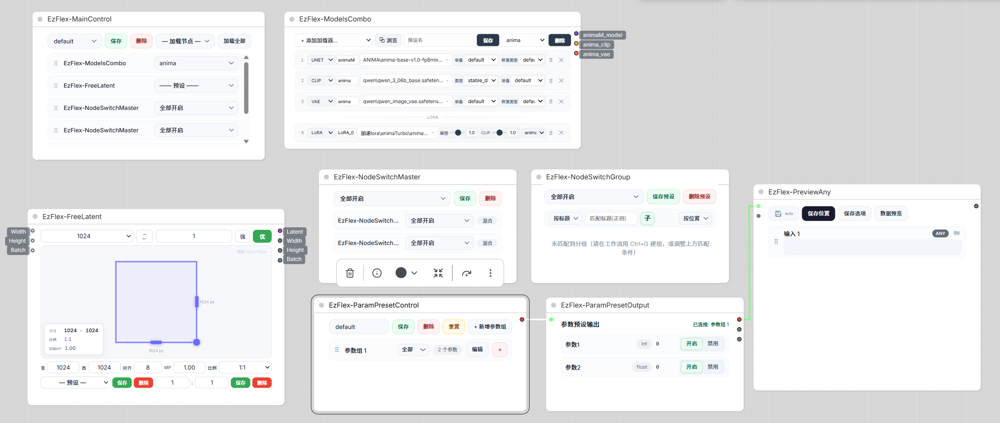

# Comfyui-EzFlex-Presets（V1.03 稳定版）

用于comfyui的灵活组合插件，使用ai构建完成，目前插件还在更新完善中。



## EzFlex 节点列表：
- 总控制节点( `MainControl`）
- 模型组合加载器（`EzFlex-ModelsCombo`)
- 分辨率/Latent 选择器（`EzFlex-FreeLatent`）
- 节点总控制(`NodeSwitchMaster`)
- 节点开关组（`NodeSwitchGroup`)
- 参数预设控制节点（`ParamPresetControl`）
- 参数输出控制节点（`ParamPresetOutput`）
- 任意预览（`EzFlex-PreviewAny`）
- 提示词助手（`EzFlex-PromptHelper`）
- 共 **9 个节点**

## 版本更新内容：

- V1.03：优化ReadMe描述，FreeLatent增加强制生效按键（忽略外部输入宽高及批次），修复对齐后端默认按照8对齐的问题，新增提示词助手节点。
- V1.02：优化ModelsCombo画廊浏览搜索逻辑。
- V1.01：优化参数预设控制节点切换预设连线逻辑。
- V1.0：稳定发行第一版。

## 安装

把本目录放到 `ComfyUI/custom_nodes/` 下，重启 ComfyUI。

## 使用

Comfyui节点列表中搜索EzFlex点击选择使用。

## 节点功能

### 总控制节点( `MainControl`）：

- 控制：控制总体节点行为，目前可控节点：模型组合加载器（`EzFlex-ModelsCombo`)、分辨率/Latent 选择器（`EzFlex-FreeLatent`）、节点总控制(`NodeSwitchMaster`)、参数预设控制节点（`ParamPresetControl`）。
- 预设：可自由组合保存删除总体节点行为预设。
- 快捷加载：可快捷加载其他EzFlex节点。

### 模型组合加载器（`EzFlex-ModelsCombo`)：

- 组合加载：可自由组合加载Unet、Clip、Vae、Checkpoint、Lora模型。
- 预设：可自由组合保存删除模型加载方式。
- 预览：可预览下拉列表模型封面。
- 画廊：可画廊式预览选择加载模型。
- 输出：根据模型数量（加载器卡片）及类型生成对应数量及类型输出端口，其中lora加载器串联在选择目标model后面，多个lora按卡片顺序串联，输出名称为`自定义名称_model/clip/vae`。
- 顺序：可自由调整卡片顺序。

### 分辨率/Latent 选择器（`EzFlex-FreeLatent`）：

- 画布：可自由拖拽画布生成对应空Latent，按住ctrl可取消吸附。
- 宽高输入：可手动输入宽高。
- 对齐分辨率：根据`优化/标准`算法按照`分辨率步数`计算相应宽高，目前影响`手动输入宽高、宽高预设选择、比例及Mp值计算后的宽高`。
- MP：百万像素。
- 比例预设：宽 : 高，可选择默认比例预设及自定义比例预设。
- 宽高预设：可选择默认宽高预设及自定义宽高预设，可自定义保存删除（`根据目前实际宽高`）。
- 自定义比例：可自定义保存删除输入的比例预设。
- 信息面板：实时显示实际宽高、比例、MP值。
- 输入：外部宽高、批次数量。
- 输出：空Latent、宽高、批次数量。
- 强制生效：绿色时忽略外部宽高/批次，强制面板值生效，并解除控件禁用（仅任一输入有值时可用）

### 节点总控制(`NodeSwitchMaster`)：

- 控制：控制节点开关组行为，可自定义组合保存删除预设。

### 节点开关组（`NodeSwitchGroup`)：

- 控制：控制节点（已分组）动作行为`开启/禁用/绕过（忽略）`
- 预设：可自由保存删除节点开关预设。
- 分组匹配：按名称/按颜色，子节点匹配。
- 顺序：按位置/名称自动排序卡片。
- 注意：该节点为实例预设，删除节点后对应预设同步消失。


### 参数预设控制节点（`ParamPresetControl`）：

- 控制：`参数绿/红按钮`：是否显示在输出列表及参数组卡片下拉列表中。`参数组下拉列表`：选择输出参数（输出或特定）。
- 预设：可自由保存删除参数组预设。
- 参数：目前有int、float、bool、string、complex、tuple、list、set、dictionary八种类型
- 顺序：参数组卡片、参数卡片均可自由拖动。
- 输出：根据参数组卡片数量生成对应输出端口，多参数红色，单参数灰色。

### 参数输出控制节点（`ParamPresetOutput`）：

- 控制：开启/禁用控制参数输出,int->0,bool->false，float->0.0，string等->空字符串。

### 任意预览（`EzFlex-PreviewAny`）：

- 预览类型：自动识别任意输入类型，渲染对应预览卡片（可拖拽排序，随连接自动增删）。
- 保存设置：自动保存点击后可保存否则仅预览，可选择保存位置、保存选项。
- 保存类型：

| 类型 | 接受数据 | 预览方式 | 支持格式 |
|---|---|---|---|
| IMAGE | tensor `[B,H,W,C]` | 缩略图 + 全屏原图 | PNG / JPEG / WebP / BMP / TIFF |
| MASK | 2D/3D tensor | 灰度 PNG | PNG |
| AUDIO | `{waveform,sample_rate}` 或 `(waveform,sr)` 或文件对象 | 播放器 | WAV / MP3 / FLAC / OGG / M4A / AAC |
| VIDEO | 帧列表 或 VideoFrom 文件对象 | 首帧封面 + 播放器 | MP4 / WebM / MOV / GIF / AVI / MKV |
| CONDITIONING | 含 `conditioning/context` 的 dict | 文本摘要 | — |
| LIST / TUPLE / SET | list / tuple / set | 索引值树（序号:值） | JSON |
| DICT | dict | 键值树（键:值） | JSON |
| STRING | str | 文本（截断 + 弹窗全文） | TXT / MD / JSON / CSV / LOG / HTML |
| LATENT | `{samples}` dict | shape / dtype 摘要 | — |
| MODEL_3D | File3D 对象（含 path/file） | three.js 查看器（离线） | glb / gltf / obj / fbx / stl / dae / ply |
| MODEL | ModelPatcher | 模型元数据卡 | safetensors / gguf / onnx / ckpt / pt |
| CLIP | comfy.sd CLIP | 元数据卡 | safetensors / gguf / onnx |
| VAE | comfy.sd VAE | 元数据卡 | safetensors / gguf / onnx |
| CONTROL_NET / CLIP_VISION / STYLE_MODEL / UPSCALE_MODEL / LORA_MODEL / GLIGEN / SAMPLER / SIGMAS / GUIDER / NOISE / SEGS | 对应 ComfyUI 对象 | 文本摘要 | — |
| EMPTY | 未连接 | “(未连接)” | — |

- 附加能力：媒体全屏（图片滚轮缩放/拖拽平移，视频/音频可播放、3D 可全屏）；生成信息（图片/视频/音频/3D 从内嵌、sidecar 或当前工作流兜底提取 模型 / LoRA / CLIP / VAE + 提示词 + 采样参数）；模型元数据（架构 / 作者 / 触发词 / 训练参数 / 路径 / 哈希）；保存导出（图片 / 音频 / 视频 / 文本按所选格式存到 ComfyUI 输出目录）；数据预览弹窗。

### 提示词助手（`EzFlex-PromptHelper`）：

- 工具：提示词卡片管理 + 完整富文本编辑器（加粗/斜体/颜色/字号/对齐/查找替换/取色器/规则弹窗）。
- 输入：固定 clip / 图像 / 视频 / 音频 / 3D 模型（后四者可批量）+ 每卡一个文本输入端口（按顺序链接到卡片）。
- 输出：固定「合并提示词」字符串 + 每卡一个字符串输出端口。
- 状态：开发中，`V1.03` 起列入节点清单，后续继续完善。


## 目录结构

```
Comfyui-EzFlex-Presets/
├── __init__.py          # 全部 9 节点类 + 预设路由 + 输出类型同步路由
├── pyproject.toml
├── README.md
├── user_data/           # 预设库（运行时由插件写入）：EzFlex-ModelsCombo.json / EzFlex-FreeLatent.json /
│                        #   EzFlex-NodeSwitchMaster.json / EzFlex-NodeSwitchGroup.json /
│                        #   EzFlex-MainControl.json / EzFlex-ParamPresetControl.json
│                        # 说明：这些由服务器预设路由运行期生成；你机器上若还有 EzFlex-PreviewAny.json 等，
│                        #   属本地运行产生，不是插件自带/固定的文件。
└── web/
    ├── modelscombo_node.js  # ModelsCombo 内嵌控件（addDOMWidget）
    ├── freelatent_node.js   # FreeLatent 内嵌 canvas 分辨率选择器
    ├── ezflex_service.js    # 共享：节点注册表 / 分组匹配 / node.mode / 预设库 API / 命名弹窗
    ├── node_switch_group.js # NodeSwitchGroup 面板
    ├── node_switch_master.js# NodeSwitchMaster 面板
    ├── main_control.js      # MainControl 面板
    ├── param_preset_control.js # ParamPresetControl 面板 + 动态端口
    ├── param_preset_output.js  # ParamPresetOutput 面板 + 动态端口
    ├── preview_any.js          # PreviewAny 白板 + 拖拽卡片 + 动态 socket + 预览
    ├── prompt_helper.js        # PromptHelper 提示词助手面板（开发中）
    └── libs/ utils/ curves/    # three.js 与加载器/曲线资源（本地离线，供 PreviewAny 3D 查看器用）
```

## 依赖
- torch
- numpy
- Pillow
- safetensors
- gguf
- onnx
- av
- mutagen>=1.46.0

