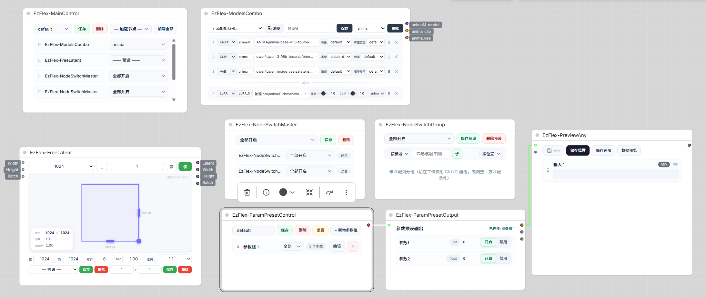

# Comfyui-EzFlex-Presets（V1.3.0 测试版-2）

[English](README.md) | **中文**

用于comfyui的灵活组合插件，使用ai构建完成，目前插件还在更新完善中。



B站演示视频：[点击观看](https://www.bilibili.com/video/BV1T8hy6JEf4)

## EzFlex 节点列表：

- 总控制节点( `MainControl`）
- 模型组合加载器（`EzFlex-ModelsCombo`)
- 分辨率/Latent 选择器（`EzFlex-FreeLatent`）
- 节点总控制(`NodeSwitchMaster`)
- 节点开关组（`NodeSwitchGroup`)
- 参数预设控制节点（`ParamPresetControl`）
- 参数输出控制节点（`ParamPresetOutput`）
- 任意预览（`EzFlex-PreviewAny`）
- 提示词助手（`EzFlex-PromptHelper`）
- 素材加载器（`EzFlex-MediaLoader`）
- 素材输出（`EzFlex-MediaOut`）
- 合并列表（`EzFlex-MergeList`）
- 拆分列表（`EzFlex-SplitList`）
- 开启循环（`EzFlex-LoopStart`）
- 结束循环（`EzFlex-LoopEnd`）
- 时间轴规划（`EzFlex-TimeLine`）
- 转接节点(`EzFlex-Reroute`)
- 共 **17 个节点**

## 版本更新内容：
- V1.3.0:优化随机tag，修复选择分类与库内分类不同的bug，新增重复分类提示（子分类与父分类重复），卡片管理新增生图功能，优化medialoader与mediaoutput端口类型与操作逻辑，优化previewany预览与保存逻辑，新增循环节点：合并列表（`EzFlex-MergeList`）、拆分列表（`EzFlex-SplitList`）、开启循环（`EzFlex-LoopStart`）、结束循环（`EzFlex-LoopEnd`）、时间轴规划（`EzFlex-TimeLine`）、转接节点（`EzFlex-Reroute`），素材加载器 medialoader、提示词助手 prompthelper 新增循环系统；标签/卡片预览图改为独立图片文件存储（`tag_preview` / `card_preview`），提示词助手新增快捷权重/预览图显示模式/卸载显存等功能，整体优化插件运行性能。
- V1.2.12:标签系统性能优化、修复卡片内容无法填充的bug，优化标签提示与引用媒体冲突的显示问题、修复previewany无法保存某些类型媒体的bug,优化保存逻辑。
- V1.2.11:修复prompthelper若干前端bug，修复api调用bug，新增api调用错误提示，全面优化标签系统：新增随机匹配/排除字段功能、相关标签功能、筛选增加隐藏nsfw、细化库内标签分类，新增anima2.9B标签库。
- V1.2.10:修复模型组合加载器modelscombo第一个端口切换窗口/刷新/重启会断连的问题；修复预设选项切换窗口/刷新会丢失的bug。
- V1.2.9:修复previewany读取图片生成信息不对的问题（提示词支持穿透连线读取），修复开关组nodeswitchgroup复制后可能匹配不到节点的问题。ModelsCombo 有配置时触发词端口常驻（无 LoRA 为空串）。
- V1.2.8:预览任意previewany节点支持批量图片预览，优化预览窗口表现。
- V1.2.7:修复预览图消失bug，优化黑框文字表现，更新对齐官方节点功能。
- V1.2.6:新增主题系统，优化FreeLatent画布，优化标签预览功能，规范数据保存，清理部分冗余代码，修复部分bug。
- V1.2.5:标签系统新增随机tag功能，标签默认库加入（上次忘传了），生成预览图增加清理功能。ModelsCombo支持加载lora自动生成触发词功能(promptHelper内可实时显示),浏览增加查看已加载模型功能。修复黑色标签子节点不显示以及快速移动残留bug。总体编辑支持单个卡片折叠。
- V1.2.4:提示词助手大更新：新增标签系统/卡片管理系统，提升安全性。
- V1.2.3:修复若干bug，持续全面提升安全性，增强节点功能。
- V1.2.2:修复EzFlex-NodeSwitchGroup下拉列表bug，修复EzFlex-ParamPresetControl换预设后EzFlex-ParamPresetOutput、EzFlex-PreviewAny等无法校验输入的bug，优化EzFlex-FreeLatent自定义宽高预设位置。修复medialoader预览弹窗控件无法点击的bug。修复medialoader加载3d模型及预览图速度过慢的bug。修复promptHelper 高亮逻辑。
- V1.2.1:修复node2.0模式提示词助手（`EzFlex-PromptHelper`）、素材加载器（`EzFlex-MediaLoader`）、素材输出（`EzFlex-MediaOut`）无法点击的bug。提示词助手（`EzFlex-PromptHelper`）和节点开关组（`NodeSwitchGroup`)新增收起展开栏。全面优化安全潜在问题，增强插件安全性。
- V1.2.0：全面优化安全相关问题,总控制节点( `MainControl`）增加英文切换。
- V1.11：提示词助手功能全面优化，修复bug。
- V1.1：插件节点全面完善、性能、提示词助手（`EzFlex-PromptHelper`）功能全面增强、修复适配bug。
- V1.05：提示词助手新增「引用媒体」，强化媒体引用@功能。
- V1.04：新增素材加载器( `EzFlex-MediaLoader`）与素材输出 (`EzFlex-MediaOut`）节点；全面优化提示词助手（`EzFlex-PromptHelper`）（仍在更新开发中）。
- V1.03：优化ReadMe描述，FreeLatent增加强制生效按键（忽略外部输入宽高及批次），修复对齐后端默认按照8对齐的问题，新增提示词助手节点。
- V1.02：优化ModelsCombo画廊浏览搜索逻辑。
- V1.01：优化参数预设控制节点切换预设连线逻辑。
- V1.0：稳定发行第一版。

## 安装

- 把本目录放到 `ComfyUI/custom_nodes/` 下，重启 ComfyUI。
- 依赖：本插件**只需要额外装 `mutagen`**（读音频/视频标签），其余（torch / numpy / Pillow / safetensors / av）ComfyUI 自带；不想手动装就 `pip install -r requirements.txt`。
- 可选（**不写进 requirements**，避免 ComfyUI-Manager 安装时强制编译，需要时手动装）：`llama-cpp-python`（提示词助手的「进程内 llama-cpp-python」模式）、`gguf` / `onnx`（读这两类模型的元数据卡）。也可一次装齐：`pip install -e .[llama,metadata]`。

## 使用

Comfyui节点列表中搜索EzFlex点击选择使用。

## 节点功能

### 总控制节点( `MainControl`）：

- 控制：控制总体节点行为，可自定义组合保存删除预设。
- 卡片列表：模型组合加载器（`EzFlex-ModelsCombo`）、分辨率/Latent 选择器（`EzFlex-FreeLatent`）、节点总控制（`NodeSwitchMaster`）、参数预设控制节点（`ParamPresetControl`）四类，各自带预设下拉、可拖拽排序。总预设会把它们的当前预设一起记下来，切换总预设时级联下推。**节点开关组不在这里单独列** —— 它归「节点总控制」管。
- 快捷加载：可快捷加载其他EzFlex节点（**素材输出（`MediaOut`）由素材加载器（`EzFlex-MediaLoader`）单独加载**）。
- 语言：可切换中英文。
- 主题：一套配色切换全部 EzFlex 面板（浅色 / 藕荷 / 青苔 / 北境 / 极简冷灰 / 暖白焦糖 / 冷灰雾蓝 / 深空黑 / 莫兰迪紫灰 / 人鱼核 / 巧克力棕 / 克莱因蓝 / 云舞白 / 香蕉黄 / 勃艮第红 / 深青绿，共 16 套）。配色集中在主题模块里，面板只写 CSS 变量，切换即时重绘所有已打开面板。

### 模型组合加载器（`EzFlex-ModelsCombo`)：

- 组合加载：可自由组合加载Unet、Clip、Vae、Checkpoint、Lora模型。
- 预设：可自由组合保存删除模型加载方式。
- 预览：可预览下拉列表模型封面。
- 画廊：可画廊式预览选择加载模型。(需要Comfyui-lora-magager插件通过c站生成json文件)
- 输出：根据模型数量（加载器卡片）及类型生成对应数量及类型输出端口，其中lora加载器串联在选择目标model后面，多个lora按卡片顺序串联，输出名称为`自定义名称_model/clip/vae`。
- 顺序：可自由调整卡片顺序。

### 分辨率/Latent 选择器（`EzFlex-FreeLatent`）：

- 画布：可自由拖拽画布生成对应空Latent，按住ctrl可取消吸附。
- 宽高输入：可手动输入宽高。
- 对齐分辨率：根据`优化/标准`算法按照`分辨率步数`计算相应宽高，目前影响`手动输入宽高、宽高预设选择、比例及Mp值计算后的宽高`。
- MP：百万像素。
- 比例预设：宽 : 高，可选择默认比例预设及自定义比例预设。
- 宽高预设：可选择默认宽高预设及自定义宽高预设，可自定义保存删除（`根据目前实际宽高`）。
- 自定义比例：可自定义保存删除输入的比例预设。
- 信息面板：实时显示实际宽高、比例、MP值。
- 输入：外部宽高、批次数量。
- 输出：空Latent、宽高、批次数量。
- 强制生效：绿色时忽略外部宽高/批次，强制面板值生效，并解除控件禁用（仅任一输入有值时可用）

### 节点总控制(`NodeSwitchMaster`)：

- 控制：控制节点开关组行为，可自定义组合保存删除预设。

### 节点开关组（`NodeSwitchGroup`)：

- 控制：控制节点（已分组）动作行为`开启/禁用/绕过（忽略）`
- 预设：可自由保存删除节点开关预设。
- 分组匹配：按名称/按颜色，子节点匹配。
- 顺序：按位置/名称自动排序卡片。
- 注意：该节点为实例预设，删除节点后对应预设同步消失。

### 参数预设控制节点（`ParamPresetControl`）：

- 控制：`参数绿/红按钮`：是否显示在输出列表及参数组卡片下拉列表中。`参数组下拉列表`：选择输出参数（输出或特定）。
- 预设：可自由保存删除参数组预设。
- 参数：目前有int、float、bool、string、complex、tuple、list、set、dictionary八种类型
- 顺序：参数组卡片、参数卡片均可自由拖动。
- 输出：根据参数组卡片数量生成对应输出端口，多参数红色，单参数灰色。

### 参数输出控制节点（`ParamPresetOutput`）：

- 控制：开启/禁用控制参数输出,int->0,bool->false，float->0.0，string等->空字符串。
- 类型提示：显示实际类型，若值与参数预设控制节点（`ParamPresetControl`）设定类型不一致，默认输出string并标红。
- 值预览：可点击弹窗预览。

### 任意预览（`EzFlex-PreviewAny`）：

- 预览：自动识别任意输入类型，渲染对应预览卡片（可拖拽排序，随连接自动增删）。
- 保存：默认只预览，点「自动保存」后才落盘；保存选项随格式变化（无损格式不出码率、无损图不出质量），IMAGE / AUDIO / VIDEO 有「保持原样」；文件名支持 `%year% %month% %day% %hour% %minute% %second%`。
- 批次：一张卡最多导出 64 帧；多图存档方式（自动 / 批量图片 / 视频 / 动图）由卡片上单独选。
- 支持类型与保存细则：

| 类型                                                                                                                       | 接受数据                                              | 预览方式                                     | 支持格式                                                  |
| ------------------------------------------------------------------------------------------------------------------------ | ------------------------------------------------- | ---------------------------------------- | ----------------------------------------------------- |
| IMAGE                                                                                                                    | tensor `[B,H,W,C]`                                | 缩略图 + 全屏原图（批次：弹窗缩略图条翻页；可存图片序列 / 视频 / 动图） | PNG / JPEG / WebP / BMP / TIFF / 动图（WebP / PNG / GIF） |
| MASK                                                                                                                     | 2D/3D tensor                                      | 灰度 PNG                                   | PNG                                                   |
| AUDIO                                                                                                                    | `{waveform,sample_rate}` 或 `(waveform,sr)` 或文件对象  | 播放器                                      | WAV / MP3 / FLAC / OGG / M4A / AAC                    |
| VIDEO                                                                                                                    | `VideoFromFile` / `VideoFromComponents` 对象        | 首帧封面 + 播放器                               | MP4 / WebM / MOV / GIF / AVI / MKV                    |
| CONDITIONING                                                                                                             | 含 `conditioning/context` 的 dict                   | 文本摘要                                     | —                                                     |
| LIST / TUPLE / SET                                                                                                       | list / tuple / set                                | 索引值树（序号:值）                               | JSON                                                  |
| DICT                                                                                                                     | dict                                              | 键值树（键:值）                                 | JSON                                                  |
| STRING / INT / FLOAT / BOOLEAN                                                                                           | str / int / float / bool                          | 文本（截断 + 弹窗全文）                            | TXT / MD / JSON / CSV / LOG / HTML                    |
| LATENT                                                                                                                   | `{samples}` dict                                  | shape / dtype 摘要                         | —                                                     |
| FILE_3D                                                                                                                  | `File3D` 对象（内置 Load3D 同款）                         | three.js 查看器（离线）                         | glb / gltf / obj / fbx / splat                        |
| MODEL_3D                                                                                                                 | File3D 对象（含 path/file）                            | three.js 查看器（离线）                         | glb / gltf / obj / fbx / splat                        |
| MESH                                                                                                                     | `Types.MESH`（顶点/面张量，Hunyuan3D / Trellis / MoGe 等） | 顶点/面导成临时 OBJ → three.js 查看器              | 顶点 ≤50 万、面 ≤100 万（超了只给摘要）                             |
| SPLAT / VOXEL                                                                                                            | `Types.SPLAT` / `Types.VOXEL`（张量）                 | 文本摘要（点数 / SH 系数 / 体素分辨率）                 | —                                                     |
| MODEL                                                                                                                    | ModelPatcher                                      | 模型元数据卡                                   | safetensors / gguf / onnx / ckpt / pt                 |
| CLIP                                                                                                                     | comfy.sd CLIP                                     | 元数据卡                                     | safetensors / gguf / onnx                             |
| VAE                                                                                                                      | comfy.sd VAE                                      | 元数据卡                                     | safetensors / gguf / onnx                             |
| CONTROL_NET / CLIP_VISION / STYLE_MODEL / UPSCALE_MODEL / LORA_MODEL / GLIGEN / SAMPLER / SIGMAS / GUIDER / NOISE / SEGS | 对应 ComfyUI 对象                                     | 文本摘要                                     | —                                                     |
| EMPTY                                                                                                                    | 未连接                                               | “(未连接)”                                  | —                                                     |


- 保存细则：
  - **保存开关**：默认只预览；点「自动保存」后才会落盘，可另选保存位置与保存选项。
  - **保存选项随格式变化**：无损格式不出「码率」、无损图不出「质量」；IMAGE / AUDIO / VIDEO 有「保持原样」（从文件加载的直接复制原文件、不重编码）。
  - **文件名**：支持 `%year% %month% %day% %hour% %minute% %second%`；留空则用卡片名并自动编号。
  - **模型类**（MODEL / CLIP / VAE / LORA_MODEL）：只存信息文本（摘要 + 元数据），**不复制模型文件**。
  - **批次图片**：一张卡最多导出 64 帧（更多只记数量）；角标按工作流上游节点类名（含 video/frame/sequence 等）显示 images / frames —— 批量出图与视频抽帧在张量上无法区分。
  - **多图存档方式**由卡片上的「多图保存类型」单独选（自动 / 批量图片 / 视频 / 动图，默认自动，只对多图卡片生效）：自动＝抽帧→合成视频、批量出图→逐张；动图格式 / 帧率 / 无损在「保存类型」里设。文件名为 `名字_编号_NN`。非多图卡片按类型正常保存。
  - **预览方式**：数据预览弹窗 / 生成信息。

### 提示词助手（`EzFlex-PromptHelper`）：

- 卡片：增删 / 拖拽排序 / 双击改名；每张卡有「默认 / 优化提示词」两页和「合」开关（绿=进合并，灰=不进）。
- 编辑器：Word 风格工具条（加粗/斜体/下划线、对齐、字号、字体颜色、高亮、首行缩进、查找替换、取色器、全半角转换）+ skill 按键（选 *.md 按行插入光标处）。
- 引用媒体：实时读画布上生成节点的媒体端口，按端口算出 @图片N / @视频N / @音频N 编号；「引用媒体」窗口按生成节点分块列素材，+ 插入 / − 移除 / 右键设为全体引用库。
- 提示词规范：「设置·规则设置」里 15 条内置规范（含「不编译」「使用 API」）+ 自定义（可改可存、支持中英双语变体与 中|EN 切换），把引用标记编译成各家写法（`<Picture 1>`、`@image1` …）。
- 优化：工具下拉「优化提示词 (API) / (TextGenerate) / (llama)」；可点一次用，也能开「运行期自动优化」；三个开关互斥，失败直接报错。
- 快捷加权：光标停在某个标签上时，按 **Ctrl+↑ / Ctrl+↓** 按「加权步长」加/减它的权重（在 设置·其他设置 里改，默认 0.05）—— 如 `long_hair` → `(long_hair:1.05)`，权重回到正好 1 时自动去掉括号变回裸标签 `long_hair`。跟随光标：先用方向键移动光标，再按快捷键就加/减**当前光标处**那个标签。范围限制在 0.05 – 10。
- 折叠：卡片弹窗 / 总体编辑里有两条悬停才显示的折叠条，分别折叠**工具条**和**默认/优化提示词页签行**（文本区永不折叠）。折叠状态存进节点配置，刷新重启后保持；两条都收起时并排合并成一条「全部展开」条，同样悬停才出现，点它一键全展开。
- 标签入口：卡片弹窗 / 总体编辑底栏「提示」右侧有 **标签** 按钮，点开标签面板 —— 即使提示词工具条已收起也能用。
- 卡片管理：把卡片存成预设（`user/EzFlex/prompts/<名称>.json`），可只存点选的几张、选中即加载、删除。
- 端口：没有 CLIP 输入 —— 动态「综合媒体」口（ANY，图像/视频/音频/3D）+ 每卡一个文本输入口；输出「合并提示词」+ 每卡一个。
- 设置：通用 / 规则 / API / TextGenerate / llama / 路径 六个页签。
- 模式：头部「⧉ 平铺 / 🗗 弹窗」一键切换窗口形态。
- 优化规则与规范编译：
  - 两层滑块：**卡片**弹窗里的「默认 / 优化」只管**那张卡的输出端口**；**总体编辑**里的&#x7BA1;**「合并提示词」端口**。两层的优化内容各自成槽位，互不覆盖。
  - **工具优化** —— 卡片弹窗「工具 → 优化提示词」：源**固定取该卡「默认」页签**，结果写入该卡「优化」槽并把滑块切到优化，默认正文不动。总体编辑「工具 → 优化提示词」：源 = 各&#x5361;**「默认」正文**按顺序用「卡片合并分隔符号」拼成一份（「合」灰卡、空卡不占位），**单次调用**；结果写进「整体优化结果」并把总编辑滑块切到优化，原卡内容不变。两处遵守同一张表：

| 滑块      | 默认 | 优化    | 行为                                 |
| ------- | -- | ----- | ---------------------------------- |
| 默认 / 优化 | 有  | 无     | 使用默认提示词进行优化 → 填满优化槽，滑块切到优化         |
| 默认 / 优化 | 有  | 有     | 使用默认提示词进行优化 → **覆盖**优化槽（不沿用手改过的优化） |
| 任意      | 空  | 有 / 无 | 弹「当前卡片没有可优化的提示词内容。」                |

- **运行时优化 —— 三个自动优化开关任一开**：自动优化失败（API / TextGenerate / llama 报错）**直接报红停止**。优化槽位是“记忆”：有内容就**不重复调用**，空才调用。**总体层 → 「合并提示词」**（源 = 合=绿卡的**默认**正文合并，按卡片合并分隔符号）：

| 总编辑滑块 | 默认  | 优化 | 行为                                |
| ----- | --- | -- | --------------------------------- |
| 任意    | 有   | 无  | 先整体优化一次 → 写进「整体优化结果」→ 滑块切优化 → 输出它 |
| 优化    | 有/空 | 有  | 直接输出「整体优化结果」（**不重复优化**），滑块不动      |
| 默认    | 有   | 有  | 输出**默认合并**（优化版存着不用，也不优化），滑块不动     |
| 默认    | 空   | 有  | 输出「整体优化结果」，滑块切到优化                 |
| 任意    | 空   | 空  | 输出空（用户自己没写），滑块不动                  |

- **各卡片 → 「卡片 i」端口**：**「合」为绿**（进合并）运行期**不单独优化**，严格按该卡滑块输出 —— 默认就输出默认、优化就输出优化；**指到空槽就输出空**（不回落）。卡片列表标记跟随滑块（「优」/「默」）。**「合」为灰**（不进合并）运行期**按需单独优化**（结果只进它自己的端口）：

| 滑块 | 默认 | 优化 | 卡片端口                              |
| -- | -- | -- | --------------------------------- |
| 任意 | 有  | 无  | 拿默认单独优化一次 → 填满该卡优化槽 → 端口=结果，滑块切优化 |
| 默认 | 有  | 有  | 端口=默认（优化版存着不用，也不优化），滑块不动          |
| 优化 | 有  | 有  | 端口=优化版（不重复优化），滑块不动                |
| 任意 | 空  | 有  | 端口=优化版（不重复优化）；滑块在默认则切到优化          |
| 任意 | 空  | 空  | 端口=空，滑块不动                         |

- 端口数量 = 卡片数 + 1（第 0 口「合并提示词」，其后「卡片 1..N」全是 STRING）；卡片增删/排序后端口跟着变。`card_in_i` 连了外部文本时覆盖该卡（面板上该卡置灰），也用它参与合并与优化。
- **三个开关全关**：不做任何优化调用，与上面同一套「严格按滑块、空就空」规则。**总体编辑**：滑块在**默认** → 输出**默认合并**（各卡默认正文，按「合」过滤，灰卡不并）；在**优化** → 输出「整体优化结果」。空就空，不回落、不补齐。**各卡片**（「合」绿、「合」灰同一套）：默认 → 该卡默认正文；优化 → 该卡优化内容；空就空。卡片滑块**不影响**「合并提示词」—— 合并口只取各卡的默认正文（这也是卡片优化内容只走“自己那个端口”的原因）。
- **规范编译（引用媒体）在哪一步**：送去 API / TextGenerate / llama 的正文 = **未编译的原文**（就是你写的 `@图片1` / `@视频1` / `@音频1`）；系统提示明确要求模型**原样保留**这些标记（不翻译、不改写、不重新编号）。两个优化槽位（该卡「优化提示词」/「整体优化结果」）里存的也是**模型原文**（未编译）—— 换个规范还能重新编，不会丢掉映射。**只有输出口才过规范编译**：`卡片 i` 端口，以及「合并提示词」用到的默认合并 / 整体优化内容；编译是幂等的。模型**保留了** `@图片1` → 输出自动变成该规范写法（如 `<Picture 1>`）；模型把它**翻译/改写成自然语言**（"第一张图"）→ 标记没了，任何编译都救不回来（只能靠系统提示降低概率，或换更守规矩的模型）。

### 素材加载器（`EzFlex-MediaLoader`）：

- 预设：可保存删除分组及卡片组状态和名称。
- 参数：每行卡片数量、卡片高度倍数（默认 1）。
- 分组 / 卡片组 / 媒体卡片：拖拽排序、双击改名、右键菜单、长按拖拽合并、悬停信息、点击预览、删除。
- 浏览：文件资源管理器式（目录树、后退/前进/上级/刷新、手动路径输入、搜索、批量选择）。
- 输出：每张卡片一个端口，类型是list，可按设定输出模式对应内容，可设定拼接。
- 可加载类型：图片 / 视频 / 音频 / 3D 模型 / 文本 / 其它，输出值与 ComfyUI 内置加载节点同款，可直接接标准节点。
- 循环模式：可按照设定格式排布固定媒体面板（右键循环按键设置）
- 支持扩展名：图片 `.png .jpg .jpeg .webp .gif .bmp .tif .tiff`｜视频 `.mp4 .webm .mov .mkv .avi .m4v`｜音频 `.mp3 .wav .flac .ogg .aac .m4a .opus .wma`｜3D `.obj .glb .gltf .fbx .stl .ply .spz .splat .ksplat .3ds .dae .blend`｜文本/其它 → STRING。
- 顶栏「加载输出」：一键生成一个 EzFlex-MediaOut 并连好线。
- ⚠️ **根目录（可浏览根）设置请谨慎**：默认只能浏览 ComfyUI 自己的 `input` / `output`，要进别的目录得在工具栏输入路径 → 点「保存根目录」显式登记。**只有能访问到你 ComfyUI 端口的人才看得到这些根** —— 默认只听 `127.0.0.1` 时加不加根都只影响你自己；一旦 `--listen 0.0.0.0`、内网穿透或反代到公网，同一网络/公网的人就能列出并下载你登记过的目录。所以：别登记盘符、用户主目录、项目根这类宽目录（插件也会拒绝整盘，历史遗留整盘条目会自动清除）；登记/删除只允许本机；用完就删（内置 `input` / `output` 删不掉）。

### 素材输出（`EzFlex-MediaOut`）：

- 输入：单一输入（list格式），接 `EzFlex-MediaLoader` 的某张卡片端口。
- 输出：按文件真实类型着色/定型的中性端口 —— IMAGE / VIDEO / AUDIO / FILE_3D / STRING（与内置加载节点同款，可直接接标准节点）。
- 开关：可单开/单关；拆分模式下禁用保留端口并输出 `None`（重启用不用重连），其余模式禁用即从分组剔除。**运行时**（排队提交前）会把「已禁用但仍连着」的那条输入从**提交的 prompt** 里摘掉 —— 下游按「没连接」处理，**画布连线与保存的工作流都不动**。

### 合并列表（`EzFlex-MergeList`）：

- 主要功能：把多个输入按顺序拼成一个列表。
- 输入口按需增删（`input_1..20`）；输入本身是列表就展开并入，不是列表就追加为一项。
- 输出一个 `*` 列表口，可直接接 `EzFlex-SplitList` 或别的列表节点。

### 拆分列表（`EzFlex-SplitList`）：

- 主要功能：把一份列表拆成多个输出口（与 MergeList 互为逆操作）。
- 输出口按需增删。

### 开启循环（`EzFlex-LoopStart`）：

- 主要功能：循环起点。面板只有一个 `index` 框 —— 本次从第几轮开始（默认 0）。运行期它是只读的，每轮 +1。
- 输出口：`index`（INT，固定排第一，接 PromptHelper / MediaLoader / TimeLine 的 index 输入口）+ `value1`、`value2`……（动态，**连一个加一个**）。
- 输入口：`index`（可选，想用图里的值驱动起始轮次时接）+ `initial value1`、`initial value2`……（动态，每个 value 口配一个）。这就是初值口：**回喂还没来的时候，`valueN` 输出对应的 `initial valueN`**（不接就什么都不输出）。接你预期 End 第 N 口会带回来的同类数据 —— 下游若是 torch.cat / VAE 这类吃实值的节点，第 1 轮收到空值会报错，这时必须给初值。
- `valueN` 是「上一轮 End 第 N 口收到的值」的回喂；从第 2 轮起它覆盖初值。
- 轮数不在这里，在 LoopEnd 面板的「次数」框。

### 结束循环（`EzFlex-LoopEnd`）：

- 主要功能：循环触发器 + 终点。面板只有一个「次数」框，数是**总轮数**（含第 1 轮）：0 或 1 = 只跑 1 次（等于普通运行）、N = 一共跑 N 次。
- 输入口 `value1`、`value2`……（动态，**连一个加一个**，与 Start 的输出一一对应）：**这口收什么，下一轮 Start 同编号口就输出什么**。
- 跑完总轮数后这些值原样从 `out1`、`out2`…… 吐出（吐的是**最后一轮**这些口收到的值；想让 `outN` 就是「每轮一项的累积列表」，把 `EzFlex-MergeList` 的输出接进 `valueN`）。
- ⚠️ 别在画布上把 End 连回 Start —— 连上会成环报错 `Dependency cycle detected`。
- ⚠️ `outN` 只能喂**循环体外**的节点：循环体 = Start 的下游（到 End 为止）。TimeLine 的 `video` 口在循环体内（它吃 `LoopStart.index`），所以「LoopEnd.out1 → TimeLine.video」会成环；正确写法是「LoopStart.valueN → TimeLine.video」（valueN 就是前面几轮累积到的值）。

### 时间轴规划（`EzFlex-TimeLine`）：

- 主要功能：按模型帧网格把总时长切成分段，给出每段的帧数与总段数。
- 输入：`index`（接循环的 index）与 `video`（分段成片列表，第 i 项 = 第 i 段）。
- 输出：`frames`（该段生成帧数）、`overlap_frames`（重叠帧数）、`segments`（总段数；轮数事先不确定时接到 LoopEnd 的「次数」）。
- 内置 minimax_h3 / wan / ltx 三套模型参数；分段在「上方大预览 + 底部拼接轨」面板里可视化。

### 转接节点(`EzFlex-Reroute`)：

- 中转：中途转接节点，用于较大工作流。
- 连接：连接后自动增加可连端口，转接卡片可自定义名称。
- 颜色：端口与连线颜色跟随上游输出口（VAE 红 / CLIP 黄 / MODEL 紫…），可一眼看清转接的是什么。

## 目录结构

```
Comfyui-EzFlex-Presets/
├── __init__.py          # 全部 17 个节点类 + 预设路由 + 输出类型同步路由
├── pyproject.toml
├── README.md            # 英文说明（默认首页）
├── README_ZH.md         # 中文说明（本文件）
├── docs/                # 详细参考与调研笔记（循环机制 / 长视频 / Director …）
├── user_data/           # 预设库（运行时由插件写入）
├── locales/zh/nodeDefs.json  # 官方 i18n：节点名 / 描述 / tooltip 中文
└── web/                 # 前端面板（每个节点一个 *_node.js；共享模块 ezflex_service/i18n/theme）
    ├── ezflex_service.js       # 共享：注册表 / 分组匹配 / 预设库 API / 面板工具
    ├── ezflex_i18n.js          # 面板 i18n：ezT(key) + 中文词典（英文是源串）
    ├── ezflex_theme.js         # 主题：16 套配色 → 共享 CSS 变量（--ez-*）
    ├── ezflex_media_index.js   # 媒体编号引擎（生成节点媒体端口 → 图片N/视频N/音频N）
    ├── ezflex_listview.js      # 列表/文本预览弹窗
    └── libs/ utils/ curves/    # three.js 与加载器/曲线资源（本地离线，供 3D 查看器用）
```

## 说明
- 本插件为个人开发，使用 AI 辅助构建，仍在持续更新完善中，欢迎反馈问题与建议。
- 预设与缓存数据写在 `user/EzFlex/` 下；工作流里只保存节点自身的配置。
